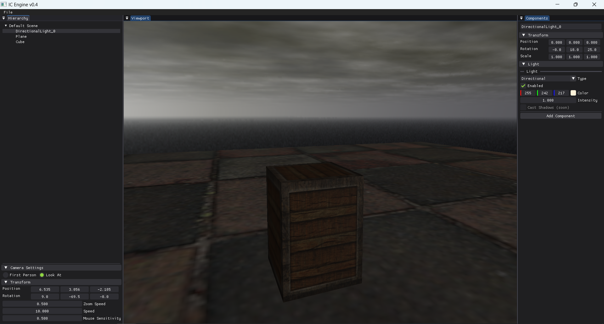

# IC Engine

Sounds like a cool combustion engine. This engine renders stuff so that I can create games.



## Features

- Scene serialization and saving and loading different scenes.
- Fast asset loads for loading large file (gltf for now) using serialization and caching.

## Build commands

To build the project:

- Clone the project. You also need to install git lfs before this if you want to download all the assets as well.
  
```bash
git clone --recursive https://github.com/RottenDoom/ic-engine.git
git submodule update --init --recursive
git lfs pull
```

- Build the project using cmake. You have to install cmake version 3.28+.

```bash
build-all.bat gcc debug
```

OR

```bash
cmake --preset="gcc-debug"
cmake --build --preset="gcc-debug"
```

The executable can be found inside `build/build-gcc/bin/Debug/`. You can also use clang compiler now. I am setting up more build presets in [Presets](CMakePresets.json).


Todos and Issues can be found in [TODO.md](TODO.md).
